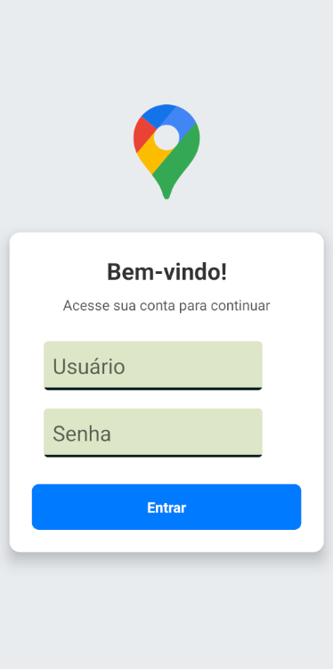
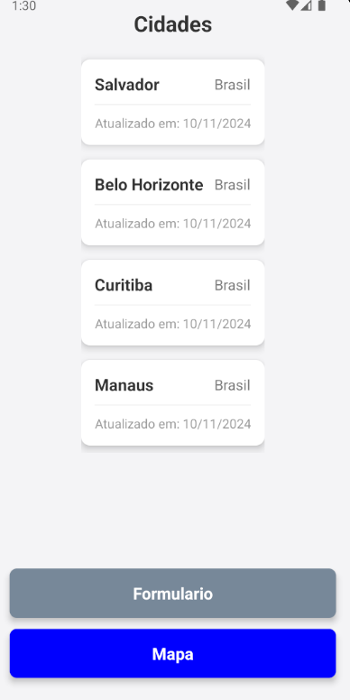
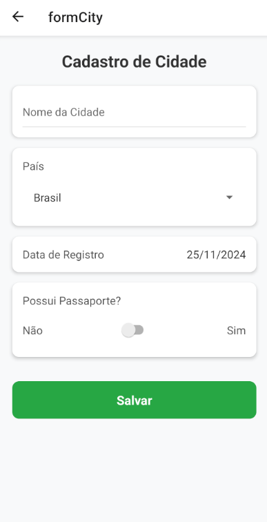
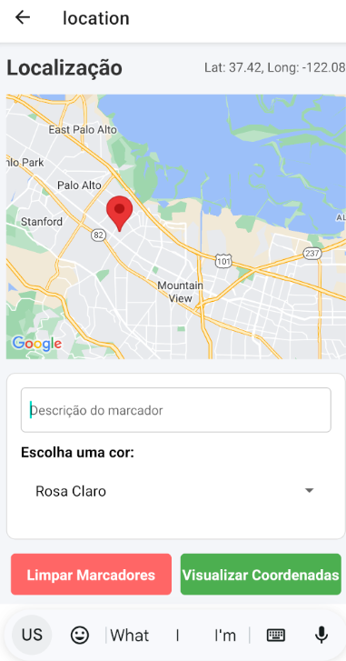
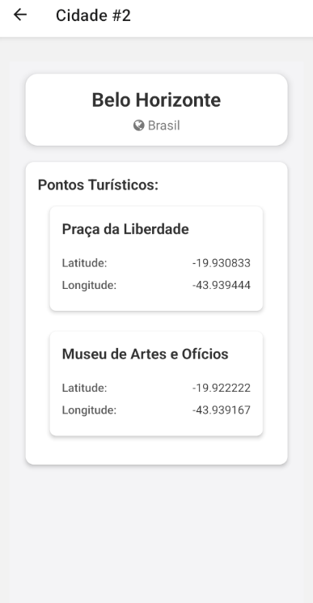

#Aluno:Bruno Rodrigues dos Santos Silva

Disciplina: Desenvolvimento Front-end com React Native [24E4_2]

#Prints

TELA DE LOGIN

TELA DE CIDADES

FORMULARIO

LOCALIZACAO

COORDENADAS

DETALHES CIDADES

